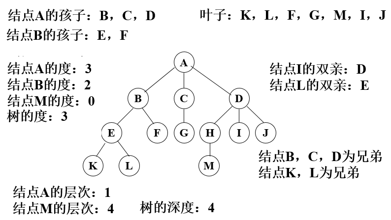

# **Datastructure-day01回顾**

- **数据结构、算法、程序**

  ```python
  【1】数据结构: 解决问题时使用何种数据类型，数据到底如何保存，只是静态描述了数据元素之间的关系
  【2】算法:    解决问题的方法，为了解决实际问题而设计的，数据结构是算法需要处理的问题载体
  【3】程序:    数据结构 + 算法
  ```
  
- **数据结构分类**

  ```python
  # 1. 按逻辑结构划分
  【1】线性结构: n个数据元素的有序集合
  【2】树形结构: 非线性数据结构，数据元素之间存在一对多的树形关系
  【3】图状结构: 比较复杂，数据元素之间存在多对多关系
  【4】其他结构: 根据实际情况抽象的模型
  
  
  # 2. 按存储结构划分
  【1】顺序存储 - 线性表
      1.1 定义: 将数据结构中各元素按照其逻辑顺序存放于存储器一片连续的存储空间中
      1.2 示例: 顺序表、列表
      1.3 特点: 内存连续，溢出时开辟新的连续内存空间进行数据搬迁并存储
  
  【2】链式存储 - 线性表
      2.1 定义: 将数据结构中各元素分布到存储器的不同点，用记录下一个结点位置的方式建立联系
      2.2 示例: 单链表、单向循环链表
      2.3 特点:
          单链表: 内存不连续，每个节点保存指向下一个节点的指针，尾节点指针指向"None"
          单向循环链表: 内存不连续，每个节点保存指向下一个节点的指针，尾节点指针指向"头节点"
  ```

- **算法效率衡量-时间复杂度T(n)**

  ```python
  【1】定义: 算法执行步骤的数量
  
  【2】分类
      2.1) 最优时间复杂度
      2.2) 最坏时间复杂度 - 平时所说
      2.3) 平均时间复杂度
  
  【3】时间复杂度大O表示法 T(n) = O(??)
      去掉执行步骤的系数、常数、低次幂
  
  【4】常见的时间复杂度
   4.1) O(1)
       print('全场动作必须跟我整齐划一')
      
   4.2) O(n)
      for i in range(n):
          print('左边跟我一个画个龙')
        
   4.3) O(n^2)
      for i in range(n):
        for j in range(n):
          print('在你右边画一道彩虹')
          
   4.4) O(n^3)
      for i in range(n):
          for j in range(n):
              for k in range(n):
                  print('走你')
                
   4.5) O(logn) - 循环减半
      n = 64
      while n > 1:
          print(n)
          n = n // 2
          
   4.6 O(nlogn)
      n = 64
      while n > 1:
    	    for i in range(n):
      	    print('野狼disco')
          n = n // 2
          
  【5】常见时间复杂度排序
      O(1)<O(logn)<O(n)<O(nlogn)<O(n2)<O(n2logn)<O(n3)
    
  【6】小练习
      O(5)        --> O(1)
      O(2n+1)     --> O(n)
      O(n**2+n+1) --> O(n^2)
      O(3n**3+1)  --> O(n^3)
  ```

- **递归**

  ```python
  【1】特点
      1.1) 函数自身调用自身
      1.2) 必须存在递归的出口
      
  【2】递归总结
      调用递归之前的代码，由外到内执行
      调用递归及之后的代码，由内到外执行('回归')
      
  【3】案例回顾 - 终端输出 1-n
  3.1) 非递归写法
  def f1(n):
      for i in range(1, n + 1):
          print(i)
          
  3.2) 递归版本
  def recu_one(n):
      if n > 0:
        recu_one(n-1)
        print(n)
  
  recu_one(3)
  # 结果: 1 2 3
          
  3.3) 递归版本
  def recu_two(n):
      if n > 0:
          print(n)
          recu_two(n-1)
   # 结果: 3 2 1
  
  """
  永远铭记:
  1. 调用递归之前的代码，由外到内执行
  2. 调用递归及之后的代码，由内到外执行('回归')
  """
  ```

# **Datastructure-day02笔记**

## **栈（LIFO) - Last In First Out - 后进先出**

- **定义**

  ```python
  栈是限制在一端进行插入操作和删除操作的线性表（俗称堆栈），允许进行操作的一端称为"栈顶"，另一固定端称为"栈底"，当栈中没有元素时称为"空栈"
  ```

- **特点**

  ```python
  1) 栈只能在一端进行数据操作
  2) 栈模型具有后进先出的规律
  ```


- **栈的代码实现**

  ```python
  # 栈的操作有入栈（压栈），出栈（弹栈），判断栈是否为空等操作
  """
  sstack.py  栈模型的顺序存储
  重点代码
  
  思路:
  1. 利用列表完成顺序存储,但是列表功能多,不符合栈模型特点
  2. 使用类将列表封装,提供符合栈特点的接口方法
  3. 将列表尾部作为 栈顶，列表头部作为栈底
  """
  
  # 顺序栈模型
  class Stack(object):
      def __init__(self):
          # 开辟一个顺序存储的模型空间
          # 列表的尾部表示栈顶
          self.elems = []
  
      def is_empty(self):
          """判断栈是否为空"""
          return self.elems == []
  
      def push(self,val):
          """入栈"""
          self.elems.append(val)
  
      def pop(self):
          """出栈"""
          if self.is_empty():
              raise Exception("pop from empty stack")
          # 弹出一个值并返回
          return self.elems.pop()
  
      def top(self):
          """查看栈顶元素"""
          if self.is_empty():
              raise Exception("Stack is empty")
          return self.elems[-1]
  
  
  if __name__ == '__main__':
      st = Stack()
      st.push(1)
      st.push(3)
      st.push(5)
      print(st.top())
      while not st.is_empty():
          print(st.pop())
  ```

## **队列（FIFO先进先出）**

- **定义**

  ```python
  队列是限制在两端进行插入操作和删除操作的线性表，允许进行存入操作的一端称为"队尾"，允许进行删除操作的一端称为"队头"
  ```

- **特点**

  ```python
  1) 队列只能在队头和队尾进行数据操作
  2) 队列模型具有先进先出或者叫做后进后出的规律
  ```


- **队列的代码实现** 

  ```python
  """
  队列的操作有入队，出队，判断队列的空满等操作
  思路分析:
  1. 基于列表完成数据的存储
  2. 通过封装功能完成队列的基本行为
  3. 无论那边做对头/队尾 都会在操作中有内存移动，我们定为 列表尾部入队，头部出队
  """
  
  # 队列操作
  class SQueue:
      def __init__(self):
          self.elems = []
  
      # 判断队列是否为空
      def is_empty(self):
          return self.elems == []
  
      # 入队
      def enqueue(self,val):
          self.elems.append(val)
  
      # 出队
      def dequeue(self):
          if self.is_empty():
              raise Exception("Queue is empty")
          return self.elems.pop(0) # 弹出第一个数据
  
  
  if __name__ == '__main__':
      sq = SQueue()
      sq.enqueue(10)
      sq.enqueue(20)
      print(sq.is_empty())
      print(sq.dequeue())
      print(sq.dequeue())
      print(sq.is_empty())
  ```

## **冒泡排序**

- **排序方式**

  ```python
  # 排序方式
  遍历列表并比较相邻的元素对，如果元素顺序错误，则交换它们。重复遍历列表未排序部分的元素，直到完成列表排序
  
  # 时间复杂度
  因为冒泡排序重复地通过列表的未排序部分，所以它具有最坏的情况复杂度O(n^2)
  ```


- **代码实现**

  ```python
  """
  冒泡排序
  3 8 2 5 1 4 6 7
  """
  def bubble_sort(li):
      # 代码第2步: 如果不知道循环几次，则举几个示例来判断
      for j in range(0,len(li)-1):
          # 代码第1步: 此代码为一波比对，此段代码一定一直循环，一直比对多次至排序完成
          for i in range(0,len(li)-j-1):
              if li[i] > li[i+1]:
                  li[i],li[i+1] = li[i+1],li[i]
  
      return li
  
  li = [3,8,2,5,1,4,6,7]
  print(bubble_sort(li))
  ```

## **归并排序**

- **排序规则**

  ```python
  # 思想
  分而治之算法
  
  # 步骤
  1) 连续划分未排序列表，直到有N个子列表，其中每个子列表有1个"未排序"元素，N是原始数组中的元素数
  2) 重复合并，即一次将两个子列表合并在一起，生成新的排序子列表，直到所有元素完全合并到一个排序数组中
  ```

  

  

- **代码实现 - 归并排序**

  ```python
  """
  归并排序
  """
  
  def merge_sort(li):
      # 递归出口
      if len(li) == 1:
          return li
  
      # 第1步：先分
      mid = len(li) // 2
      left = li[:mid]
      right = li[mid:]
      left_one = merge_sort(left)
      right_one = merge_sort(right)
      
      # 第2步: 再合 - 从内到外执行
      result_li = merge(left_one,right_one)
      return result_li
  
  def merge(left_one,right_one):
      """开始合并"""
      result = []
      while len(left_one) > 0 and len(right_one) > 0:
          if left_one[0] <= right_one[0]:
              result.append(left_one.pop(0))
          else:
              result.append(right_one.pop(0))
      result += left_one
      result += right_one
  
      return result
  
  
  li = [6,5,3,1,8,7,2,4]
  print(merge_sort(li))
  ```

## **快速排序**

- **排序规则**

  ```python
  快速排序也是一种分而治之的算法，如归并排序。但在大多数标准实现中，它的执行速度明显快于归并排序，并且很少达到最坏情况下的复杂度O(n) 
  
  # 排序步骤：
  1) 首先选择一个元素，称为数组的基准元素
  2) 将所有小于基准元素的元素移动到基准元素的左侧；将所有大于基准元素的元素移动到基准元素的右侧
  3) 递归地将上述两个步骤分别应用于比上一个基准元素值更小和更大的元素的每个子数组
  ```

  

- **代码实现 - 快速排序**

  ```python
  """
  快速排序
  """
  def quick_sort(li,first,last):
      # 递归终止条件
      if first >= last:
          return
  
      # 设置基准值、两个游标
      mid_value = li[first]
      left_cursor = first
      right_cursor = last
      # 开始比较，进行左右移动
      while left_cursor < right_cursor:
          # right_cursor左移
          while li[right_cursor] >= mid_value and left_cursor < right_cursor:
              right_cursor -= 1
  
          # left_cursor右移
          while li[left_cursor]  <= mid_value and left_cursor < right_cursor:
              left_cursor += 1
  
          # 两个循环结束，则交换位置
          li[left_cursor],li[right_cursor] = li[right_cursor],li[left_cursor]
  
      # 循环结束时，左右两个游标值一定相等，也就是中间值的位置
      li.insert(left_cursor+1,mid_value)
      li.pop(first)
  
      # 递归思想：对 left_cursor左边的列表进行快速排序
      quick_sort(li,first,left_cursor-1)
      # 递归思想：对 left_cursor右边的列表进行快速排序
      quick_sort(li,left_cursor+1,last)
  
  
  li = [5,9,1,11,6,7,2,4]
  quick_sort(li,0,7)
  print(li)
  ```

## **树形结构**

- **定义**

  ```python
  树（Tree）是n（n≥0）个节点的有限集合T，它满足两个条件：有且仅有一个特定的称为根（Root）的节点；其余的节点可以分为m（m≥0）个互不相交的有限集合T1、T2、……、Tm，其中每一个集合又是一棵树，并称为其根的子树（Subtree）
  ```


- **基本概念** 

  ```python
  # 1. 树的特点
  * 每个节点有零个或者多个子节点
  * 没有父节点的节点称为根节点
  * 每一个非根节点有且只有一个父节点
  * 除了根节点外,每个子节点可以分为多个不相交的子树
  
  # 2. 相关概念
  1) 节点的度: 一个节点的子树的个数
  2) 树的度: 一棵树中,最大的节点的度成为树的度
  3) 叶子节点: 度为0的节点
  4) 父节点
  5) 子节点
  6) 兄弟节点
  7) 节点的层次: 从根开始定义起,根为第1层
  8) 深度: 树中节点的最大层次
  ```



## **二叉树**

- **定义**

  ```python
  二叉树（Binary Tree）是n（n≥0）个节点的有限集合，它或者是空集（n＝0），或者是由一个根节点以及两棵互不相交的、分别称为左子树和右子树的二叉树组成。二叉树与普通有序树不同，二叉树严格区分左孩子和右孩子，即使只有一个子节点也要区分左右
  ```


- **二叉树的分类 - 见图**

  ```python
  # 1. 完全二叉树
  对于一颗二叉树，假设深度为d，除了d层外，其它各层的节点数均已达到最大值，并且第d层所有节点从左向右连续紧密排列
  
  # 2. 满二叉树
  所有叶节点都在最底层的完全二叉树
  
  # 3. 平衡二叉树
  当且仅当任何节点的两棵子树的高度差不大于1的二叉树
  
  # 二叉排序树
  任何一个节点，所有左边的值都会比此节点小，所有右边的值都会比此节点大
  ```

  

- **二叉树的特征**

  ```python
  1. 二叉树第i层上的节点最多为 2^{i-1} 个
  2. 深度为k的二叉树最多有 2^k －1 个节点
  3. 在任意一棵二叉树中，树叶的数目比度数为2的节点的数目多一
  4. 满二叉树 ：深度为k时有 2^k－1 个节点
  ```

- **二叉树 - 添加元素代码实现**

  ```python
  class Node(object):
      """节点类"""
      def __init__(self,item):
          self.elem = item
          self.left_child = None
          self.right_child = None
  
  class Tree(object):
      """二叉树"""
      def __init__(self):
          self.root = None
  
      def add(self,item):
          """添加1个节点"""
          node = Node(item)
          if self.root is None:
              self.root = node
              return
          node_list = [self.root]
  
          while node_list:
              cur_node = node_list.pop(0)
              if cur_node.left_child is None:
                  cur_node.left_child = node
                  return
              else:
                  node_list.append(cur_node.left_child)
  
              if cur_node.right_child is None:
                  cur_node.right_child = node
                  return
              else:
                  node_list.append(cur_node.right_child)
  ```

### **广度遍历 - 二叉树**


- **广度遍历 - 代码实现**

  ```python
  def breadth_travel(self):
      """广度遍历 - 查询所有节点"""
      if self.root is None:
          return
      node_list = [self.root]
      while node_list:
          cur_node = node_list.pop(0)
          print(cur_node.elem,end=" ")
          if cur_node.left_child is not None:
              node_list.append(cur_node.left_child)
              
          if cur_node.right_child is not None:
              node_list.append(cur_node.right_child)
  ```
```
  
  ### **深度遍历 - 二叉树**

​```python
# 1. 遍历
沿某条搜索路径周游二叉树，对树中的每一个节点访问一次且仅访问一次。

# 2. 遍历方式
1) 前序遍历： 先访问树根，再访问左子树，最后访问右子树 - 根 左 右
2) 中序遍历： 先访问左子树，再访问树根，最后访问右子树 - 左 根 右
3) 后序遍历： 先访问左子树，再访问右子树，最后访问树根 - 左 右 根
```


```python
1) 前序遍历结果: 1 2 4 8 9 5 10 3 6 7
2) 中序遍历结果: 8 4 9 2 10 5 1 6 3 7
3) 后序遍历结果: 8 9 4 10 5 2 6 7 3 1
```

- **深度遍历 - 代码实现**

  ```python
  # 前序遍历
  def pre_travel(self, node):
      if node is None:
          return
      print(node.elem,end=" ")
      self.pre_travel(node.left_child)
      self.pre_travel(node.right_child)
  
  # 中序遍历
  def middle_travel(self, node):
      if node is None:
          return
  
      self.middle_travel(node.left_child)
      print(node.elem, end=" ")
      self.middle_travel(node.right_child)
  
  # 后续遍历
  def last_travel(self, node):
      if node is None:
          return
  
      self.last_travel(node.left_child)
      self.last_travel(node.right_child)
      print(node.elem, end=" ")
  ```

- **二叉树完整代码**

  ```python
  class Node(object):
      """"""
      def __init__(self,item):
          self.elem = item
          self.left_child = None
          self.right_child = None
  
  class Tree(object):
      """二叉树"""
      def __init__(self):
          self.root = None
  
      def add(self,item):
          node = Node(item)
          if self.root is None:
              self.root = node
              return
          node_list = [self.root]
  
          while node_list:
              cur_node = node_list.pop(0)
              if cur_node.left_child is None:
                  cur_node.left_child = node
                  return
              else:
                  node_list.append(cur_node.left_child)
  
              if cur_node.right_child is None:
                  cur_node.right_child = node
                  return
              else:
                  node_list.append(cur_node.right_child)
  
      def breadth_travel(self):
          """广度遍历 - 查询所有节点"""
          if self.root is None:
              return
          node_list = [self.root]
          while node_list:
              cur_node = node_list.pop(0)
              print(cur_node.elem,end=" ")
              if cur_node.left_child is not None:
                  node_list.append(cur_node.left_child)
              if cur_node.right_child is not None:
                  node_list.append(cur_node.right_child)
      
      # 前序遍历 
      def pre_travel(self, node):
          if node is None:
              return
          print(node.elem,end=" ")
          self.pre_travel(node.left_child)
          self.pre_travel(node.right_child)
  
      # 中序遍历
      def middle_travel(self, node):
          if node is None:
              return
  
          self.middle_travel(node.left_child)
          print(node.elem, end=" ")
          self.middle_travel(node.right_child)
  
      # 后续遍历
      def last_travel(self, node):
          if node is None:
              return
  
          self.last_travel(node.left_child)
          self.last_travel(node.right_child)
          print(node.elem, end=" ")
  
  if __name__ == '__main__':
      tree = Tree()
      tree.add(1)
      tree.add(2)
      tree.add(3)
      tree.add(4)
      tree.add(5)
      tree.add(6)
      tree.add(7)
      tree.add(8)
      tree.add(9)
      tree.add(10)
      tree.breadth_travel()
      print()
      tree.pre_travel(tree.root)
      print()
      tree.middle_travel(tree.root)
      print()
      tree.last_travel(tree.root)
  ```

## **作业讲解**

```python
【1】面试题: 小明爬楼梯，一次只能上1级或者2级台阶，一共有n级台阶，一共有多少种方法上台阶？
def go_steps(n):
    if n == 1:
        return 1
    elif n == 2:
        return 2
    else:
        return go_steps(n-1)+go_steps(n-2)
```


