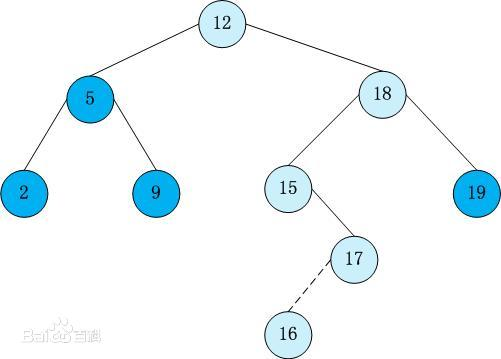

# **数据结构 - day03**

## **题目1 - 链表**

- **题目描述+试题解析**

  ```python
  【1】题目描述
      在一个排序的链表中，存在重复的结点，请删除该链表中重复的结点，重复
  的结点不保留，返回链表头指针。例如，链表 100->200->200->200->400->None 处理后为 100‐>200‐>400  
  
  【2】试题解析
      链表是递增，直接对链表取值一一判断，符合条件的保留，不符合条件的直接 pass
  ```

- **代码实现**

  ```python
  """
  在一个排序的链表中，存在重复的结点，请删除该链表中重复的结点，重复
  的结点不保留，返回链表头指针
  """
  class Node:
      def __init__(self,value):
          self.value = value
          self.next = None
  
  class Solution:
      def del_repeat_node(self,head):
          """空链表 只有1个节点链表,直接返回自身"""
          if head is None or head.next is None:
              return head
  
          cur = head
          # 100 200 200 200 400 None
          while head and head.next:
              if head.value == head.next.value:
                  head.next = head.next.next
              else:
                  head = head.next
  
          return cur
  
  if __name__ == '__main__':
      s = Solution()
      # 链表: 100 200 200 200 300
      p1 = Node(100)
      p2 = Node(200)
      p3 = Node(200)
      p4 = Node(200)
      p5 = Node(300)
      p1.next = p2
      p2.next = p3
      p3.next = p4
      p4.next = p5
      # 返回头结点: 100
      new_head = s.del_repeat_node(p1)
      print(new_head.value)
      # 打印新链表中所有节点: 100 200 300
      while new_head:
          print(new_head.value,end=" ")
          new_head = new_head.next
  
      print()
  ```

## **树形结构回顾**

- **二叉树**

  ```python
  【1】特点
      树形结构具有分支、层次特性,其形态有点象自然界中的树
  
  【2】几个概念
      2.1> 树根      	'没有父节点的节点'
      2.2> 节点的度		'一个节点的子树的个数'
      2.3> 节点的层次   '从根开始定义起，根为第1层'
      2.4> 树的深度     '树中节点的最大层次'
      
  【3】二叉树特点
      3.1> n个节点的有限集合
      3.2> 由根节点即左子树和右子树组成
      3.3> 严格区分左孩子和右孩子
      
  【4】二叉树的遍历
      4.1> 广度遍历 - 一层一层遍历，如何实现？--可利用队列
      4.2> 深度遍历
           a) 前序遍历 ：根、左、右
           b) 中序遍历 ：左、根、右
           c) 后序遍历 ：左、右、根
            
  【5】'用Python实现二叉树'
  ```

**二叉树示例**


- **二叉树遍历**

  ```python
  【1】广度遍历结果：
  【2】深度遍历
      a> 前序遍历：
      b> 中序遍历: 
      c> 后续遍历: 
  ```

- **代码实现二叉树遍历**

  ```python
  """
  二叉树
  """
  
  class TreeNode:
      """节点类"""
      def __init__(self,elem):
          # 每个节点会有3个属性（数据 左孩子 和 右孩子）
          self.elem = elem
          self.left_child = None
          self.right_child = None
  
  class Tree:
      """二叉树"""
      def __init__(self):
          self.root = None
  
      def add(self,value):
          """添加1个节点"""
          node = TreeNode(value)
          if self.root is None:
              self.root = node
              return
          node_list = [self.root]
  
          while node_list:
              cur_node = node_list.pop(0)
              if cur_node.left_child is None:
                  cur_node.left_child = node
                  return
              else:
                  node_list.append(cur_node.left_child)
  
              if cur_node.right_child is None:
                  cur_node.right_child = node
                  return
              else:
                  node_list.append(cur_node.right_child)
  
      def breadth_travel(self,root):
          """广度遍历 - 查询所有节点"""
          # 1.空树的情况
          if root is None:
              return
          # 2.非空的情况
          node_list = [root]
          while node_list:
              cur_node = node_list.pop(0)
              print(cur_node.elem,end=' ')
              if cur_node.left_child is not None:
                  node_list.append(cur_node.left_child)
  
              if cur_node.right_child is not None:
                  node_list.append(cur_node.right_child)
  
      def pre_traval(self,root):
          """前序遍历 - 根 左 右"""
          if root is None:
              return
          print(root.elem,end=' ')
          self.pre_traval(root.left_child)
          self.pre_traval(root.right_child)
  
      def middle_traval(self,root):
          """中序遍历 - 左 根 右"""
          if root is None:
              return
          self.middle_traval(root.left_child)
          print(root.elem, end=' ')
          self.middle_traval(root.right_child)
  
      def last_traval(self,root):
          """后序遍历"""
          if root is None:
              return
          self.last_traval(root.left_child)
          self.last_traval(root.right_child)
          print(root.elem, end=' ')
  
  if __name__ == '__main__':
      t = Tree()
      t.add(1)
      t.add(2)
      t.add(3)
      t.add(4)
      t.add(5)
      t.add(6)
      t.add(7)
      t.add(8)
      t.add(9)
      t.add(10)
  
      t.breadth_travel(t.root)
      print()
      t.pre_traval(t.root)
      print()
      t.middle_traval(t.root)
      print()
      t.last_traval(t.root)
  ```

## **题目2 - 二叉树**

- **题目描述+试题解析**

  ```python
  【1】题目描述
      从上到下按层打印二叉树，同一层结点从左至右输出，每一层输出一行
   
  【2】试题解析
      1、广度遍历，利用队列思想
      2、要有2个队列，分别存放当前层的节点 和 下一层的节点
  ```

- **代码实现**

  ```python
  """
  从上到下按层打印二叉树，同一层结点从左至右输出。每一层输出一行，可放到二维数组中遍历打印
  """
  
  class TreeNode:
      def __init__(self,value):
          self.value = value
          self.left = None
          self.right = None
  
  class Solution:
      def print_tree(self,root):
          if not root:
              return []
  
          # 初始队列，第1层
          cur_queue = [root]
          # 用于存放下一层的节点
          next_queue = []
  
          while cur_queue:
              node = cur_queue.pop(0)
              print(node.value,end=" ")
  
              if node.left:
                  next_queue.append(node.left)
              if node.right:
                  next_queue.append(node.right)
  
              # 当cur_queue为空时，则此层打印完毕，交换变量，继续下一层遍历
              if not cur_queue:
                  cur_queue,next_queue = next_queue,cur_queue
                  print()
  
  
  if __name__ == '__main__':
      s = Solution()
      t1 = TreeNode(1)
      t2 = TreeNode(2)
      t3 = TreeNode(3)
      t4 = TreeNode(4)
      t5 = TreeNode(5)
      t6 = TreeNode(6)
      t7 = TreeNode(7)
      t8 = TreeNode(8)
      t9 = TreeNode(9)
      t10 = TreeNode(10)
      # 开始创建树
      t1.left = t2
      t1.right = t3
      t2.left = t4
      t2.right = t5
      t4.left = t8
      t4.right = t9
      t5.left = t10
      t3.left = t6
      t3.right = t7
      t8.next = t9.next = t4
      t10.next = t5
      t4.next = t5.next = t2
      t6.next = t7.next = t3
      t2.next = t3.next = t1
  
      s.print_tree(t1)
  ```

## **题目3 - 二叉树**

- **题目描述+试题解析**

  ```python
  【1】题目描述
      请实现一个函数按照之字形打印二叉树，即第一行按照从左到右的顺序打印， 第二层按照从右至左的顺序打印，第三行按照从左到右的顺序打印，其他行以此类推
    
  【2】试题解析
      1、采用层次遍历的思想，用队列或者栈（先进先出或后进先出，此处二选一，我们选择栈）
      2、把每一层的节点添加到一个栈中，添加时判断是奇数层还是偶数层
         a) 奇数层：栈中存储时，二叉树中节点从右向左append，出栈时pop()则从左向右打印输出
         b) 偶数层: 栈中存储时，二叉树中节点从左向右append，出栈时pop()则从右向左打印输出
  ```

- **代码实现**

  ```python
  """
  请实现一个函数按照之字形打印二叉树，即第一行按照从左到右的顺序打印， 第二层按照从右至左的顺序打印，第三行按照从左到右的顺序打印，其他行以此类推
  """
  
  class TreeNode:
      def __init__(self,value):
          self.value = value
          self.left = None
          self.right = None
  
  class Solution:
      def print_binarytree(self,root):
          if not root:
              return
  
          # level：存储第几层，初始值为第1层，即根
          level = 1
          # 用来存储当前层节点，栈模式（后进先出）
          cur_stack = []
          # 临时栈：用于存储下一层节点的栈（后进先出)
          next_stack = []
          cur_stack.append(root)
          while cur_stack:
              cur_node = cur_stack.pop()
              print(cur_node.value,end=" ")
  
              # 每打印1个，就把左右孩子添加到临时栈中，打印下一层使用
              # 当前行为奇数行，把下一行节点从左向右添加，因为下一行要从右向左输出
              if level % 2 == 1:
                  if cur_node.left:
                      next_stack.append(cur_node.left)
                  if cur_node.right:
                      next_stack.append(cur_node.right)
              # 当前行为偶数行，把下一行节点从右向左添加，因为下一行要从左向右输出
              else:
                  if cur_node.right:
                      next_stack.append(cur_node.right)
                  if cur_node.left:
                      next_stack.append(cur_node.left)
  
              # 当前层空了，则交换两个栈
              if not cur_stack:
                  cur_stack,next_stack = next_stack,cur_stack
                  level += 1
                  print()
  
  if __name__ == '__main__':
      s = Solution()
      t1 = TreeNode(1)
      t2 = TreeNode(2)
      t3 = TreeNode(3)
      t4 = TreeNode(4)
      t5 = TreeNode(5)
      t6 = TreeNode(6)
      t7 = TreeNode(7)
      t8 = TreeNode(8)
      t9 = TreeNode(9)
      t10 = TreeNode(10)
      # 开始创建树
      t1.left = t2
      t1.right = t3
      t2.left = t4
      t2.right = t5
      t4.left = t8
      t4.right = t9
      t5.left = t10
      t3.left = t6
      t3.right = t7
      t8.next = t9.next = t4
      t10.next = t5
      t4.next = t5.next = t2
      t6.next = t7.next = t3
      t2.next = t3.next = t1
  
      s.print_binarytree(t1)
  ```

## **题目4 - 二叉树**

- **题目描述+试题解析**

  ```python
  【1】题目描述
      给定一棵二叉搜索树，请找出其中的第 K 小的结点。例如，(5,3,7,2,4,6,8)中， 按结点数值大小顺序第三小结点的值是 4
    
  【2】试题解析
     1、二叉搜索树定义及特点
        a> 若它的左子树不空，则左子树上所有结点的值均小于它的根结点的值； 
        b> 若它的右子树不空，则右子树上所有结点的值均大于它的根结点的值； 
        c> 它的左、右子树也分别为二叉排序树
     2、二叉搜索树的中序遍历是递增的序列，利用中序遍历来解决
  ```

  - **二叉搜索树示例**

    

- **代码实现**

  ```python
  """
  给定一棵二叉搜索树，请找出其中的第 K 小的结点。例如，(5,3,7,2,4,6,8)中， 按结点数值大小顺序第三小结点的值是 4
  """
  
  class TreeNode:
      def __init__(self,value):
          self.value = value
          self.left = None
          self.right = None
  
  class Solution:
      def __init__(self):
          self.result = []
  
      def get_k_node(self,root,k):
          array_list = self.inorder_travel(root)
          if k <= 0 or len(array_list) < k:
              return None
          return array_list[k-1]
  
      def inorder_travel(self,root):
          if root is None:
              return
  
          self.inorder_travel(root.left)
          self.result.append(root.value)
          self.inorder_travel(root.right)
  
          return self.result
  
  
  if __name__ == '__main__':
      s = Solution()
      t12 = TreeNode(12)
      t5 = TreeNode(5)
      t18 = TreeNode(18)
      t2 = TreeNode(2)
      t9 = TreeNode(9)
      t15 = TreeNode(15)
      t19 = TreeNode(19)
      t17 = TreeNode(17)
      t16 = TreeNode(16)
      # 开始创建树
      t12.left = t5
      t12.right = t18
      t5.left = t2
      t5.right = t9
      t18.left = t15
      t18.right = t19
      t15.right = t17
      t17.left = t16
  
      print(s.inorder_travel(t12))
      print(s.get_k_node(t12,3))
  ```

## **题目5 - 二叉树**

- **题目描述+试题解析**

  ```python
  【1】题目描述
      输入一棵二叉搜索树，将该二叉搜索树转换成一个排序的双向链表。要求不 能创建任何新的结点，只能调整树中节点指针的指向
    
  【2】试题解析
      a> 二叉搜索树的中序遍历是一个不减的排序结果，因此先将二叉树搜索树中序遍历
      b> 将遍历后的结果用相应的指针连接起来
  ```

**二叉搜索树示例**


- **代码实现**

  ```python
  """
  输入一棵二叉搜索树，将该二叉搜索树转换成一个排序的双向链表。要求不 能创建任何新的结点，只能调整树中节点指针的指向
  """
  
  class TreeNode:
      def __init__(self,value):
          self.value = value
          self.left = None
          self.right = None
  
  class Solution:
      def __init__(self):
          self.result = []
  
      def convert_tree_link(self,root):
          array_list = self.inner_travel(root)
          if len(array_list) == 0:
              return None
          if len(array_list) == 1:
              return root
  
          # 先把头节点和尾节点搞定
          array_list[0].left = None
          array_list[0].right = array_list[1]
          array_list[-1].left = array_list[-2]
          array_list[-1].right = None
          # 搞定中间节点
          for i in range(1,len(array_list)-1):
              array_list[i].left = array_list[i-1]
              array_list[i].right = array_list[i+1]
  
          return array_list[0]
  
      def inner_travel(self,root):
          if root is None:
              return
  
          self.inner_travel(root.left)
          self.result.append(root)
          self.inner_travel(root.right)
  
          return self.result
  
  if __name__ == '__main__':
      s = Solution()
      t12 = TreeNode(12)
      t5 = TreeNode(5)
      t18 = TreeNode(18)
      t2 = TreeNode(2)
      t9 = TreeNode(9)
      t15 = TreeNode(15)
      t19 = TreeNode(19)
      t17 = TreeNode(17)
      t16 = TreeNode(16)
      # 开始创建树
      t12.left = t5
      t12.right = t18
      t5.left = t2
      t5.right = t9
      t18.left = t15
      t18.right = t19
      t15.right = t17
      t17.left = t16
  
      head_node = s.convert_tree_link(t12)
      # 打印双向链表的头节点：2
      print(head_node.value)
      # 从头到尾打印双向链表的节点
      while head_node:
          print(head_node.value,end=" ")
          head_node = head_node.right
  
      print()
  ```


