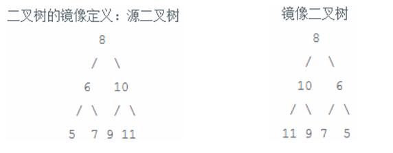

# **day04**

## **题目1 - 二叉树**

- **题目描述+试题解析**

  ```python
   【1】题目描述
       给定一棵二叉搜索树，请找出其中的第 K 小的结点。例如，(5,3,7,2,4,6,8)中,按结点数值大小顺序第三小结点的值是4
     
   【2】试题解析
      2.1) 二叉搜索树定义及特点
         a> 若它的左子树不空，则左子树上所有结点的值均小于它的根结点的值； 
         b> 若它的右子树不空，则右子树上所有结点的值均大于它的根结点的值； 
         c> 它的左、右子树也分别为二叉排序树
      2.2) 二叉搜索树的中序遍历是递增的序列，利用中序遍历来解决
  ```

  - **二叉搜索树示例**

    

- **代码实现**

  ```python
   """
   给定一棵二叉搜索树，请找出其中的第 K 小的结点。例如，(5,3,7,2,4,6,8)中， 按结点数值大小顺序第三小结点的值是 4
   """
   
   class TreeNode:
       def __init__(self,value):
           self.value = value
           self.left = None
           self.right = None
   
   class Solution:
       def __init__(self):
           self.result = []
   
       def get_k_node(self,root,k):
           array_list = self.inorder_travel(root)
           if k <= 0 or len(array_list) < k:
               return None
           return array_list[k-1]
   
       def inorder_travel(self,root):
           if root is None:
               return
   
           self.inorder_travel(root.left)
           self.result.append(root.value)
           self.inorder_travel(root.right)
   
           return self.result
   
   
   if __name__ == '__main__':
       s = Solution()
       t12 = TreeNode(12)
       t5 = TreeNode(5)
       t18 = TreeNode(18)
       t2 = TreeNode(2)
       t9 = TreeNode(9)
       t15 = TreeNode(15)
       t19 = TreeNode(19)
       t17 = TreeNode(17)
       t16 = TreeNode(16)
       # 开始创建树
       t12.left = t5
       t12.right = t18
       t5.left = t2
       t5.right = t9
       t18.left = t15
       t18.right = t19
       t15.right = t17
       t17.left = t16
   
       print(s.inorder_travel(t12))
       print(s.get_k_node(t12,3))
  ```

## **题目2 - 二叉树**

- **题目描述+试题解析**

  ```
   【1】题目描述
       输入一棵二叉搜索树，将该二叉搜索树转换成一个排序的双向链表。要求不 能创建任何新的结点，只能调整树中节点指针的指向
     
   【2】试题解析
       a> 二叉搜索树的中序遍历是一个不减的排序结果，因此先将二叉树搜索树中序遍历
       b> 将遍历后的结果用相应的指针连接起来
  ```

**二叉搜索树示例**


- **代码实现**

  ```python
   """
   输入一棵二叉搜索树，将该二叉搜索树转换成一个排序的双向链表。要求不 能创建任何新的结点，只能调整树中节点指针的指向
   """
   
   class TreeNode:
       def __init__(self,value):
           self.value = value
           self.left = None
           self.right = None
   
   class Solution:
       def __init__(self):
           self.result = []
   
       def convert_tree_link(self,root):
           array_list = self.inner_travel(root)
           if len(array_list) == 0:
               return None
           if len(array_list) == 1:
               return root
   
           # 先把头节点和尾节点搞定
           array_list[0].left = None
           array_list[0].right = array_list[1]
           array_list[-1].left = array_list[-2]
           array_list[-1].right = None
           # 搞定中间节点
           for i in range(1,len(array_list)-1):
               array_list[i].left = array_list[i-1]
               array_list[i].right = array_list[i+1]
   
           return array_list[0]
   
       def inner_travel(self,root):
           if root is None:
               return
   
           self.inner_travel(root.left)
           self.result.append(root)
           self.inner_travel(root.right)
   
           return self.result
   
   if __name__ == '__main__':
       s = Solution()
       t12 = TreeNode(12)
       t5 = TreeNode(5)
       t18 = TreeNode(18)
       t2 = TreeNode(2)
       t9 = TreeNode(9)
       t15 = TreeNode(15)
       t19 = TreeNode(19)
       t17 = TreeNode(17)
       t16 = TreeNode(16)
       # 开始创建树
       t12.left = t5
       t12.right = t18
       t5.left = t2
       t5.right = t9
       t18.left = t15
       t18.right = t19
       t15.right = t17
       t17.left = t16
   
       head_node = s.convert_tree_link(t12)
       # 打印双向链表的头节点：2
       print(head_node.value)
       # 从头到尾打印双向链表的节点
       while head_node:
           print(head_node.value,end=" ")
           head_node = head_node.right
   
       print()
  ```

## **题目3 - 二叉树**

- **题目描述+试题解析**

  ```python
  【1】题目描述
      输入一个整数数组，判断该数组是不是某二叉搜索树的后序遍历的结果
      
  【2】试题解析
      2.1) 注意题中二叉搜索树，左子树中节点值都小于根，右子树中节点值都大于根
      2.2) 后序遍历结果: 左右根
      2.3) 后序遍历后最后一个元素为二叉树根节点, 根据这个元素将传入的数组分为两部分
           左侧部分: 都比根节点小
           右侧部分: 都比根节点大
              
  【3】解题思路
      3.1) 先找到数组的最后一个元素: 即为二叉树的根节点
      3.2) 左子树节点都比根节点小,右子树节点都比根节点大
           所以我们以根节点为标准,将数组分为左右两个小数组,分别存放左右子树的节点
      3.3) 递归思想: 左右子树又必须得满足后序遍历的规则,使用递归重新调用此方法
  ```

- **代码实现**

  ```python
  class Solution:
      def verify_sort_tree_sequence(self, array_list):
          if not array_list:
              return False
  
          # 后序遍历,则最后一个节点为根节点
          root = array_list[-1]
          # 通过根节点的值将其分为左右两个小数组
          left = []
          right = []
          m = len(array_list) - 1
          # [2,9,5,16,17,15,19,18,12]
          for i in range(m):
              # 左右根，左边都比根小，一旦遇到第一个比根大的说明找到了左右子树的分界点
              if array_list[i] > root:
                  # 二叉树左子树部分
                  left.extend(array_list[:i])
                  # 二叉树右子树部分
                  right.extend(array_list[i:m])
                  break
  
          # 如果数组正确则右侧一定比root大,如果一旦出现小的则此数组不满足
          for item in right:
              if item < root:
                  return False
  
          # 递归思想,继续判断切割之后的小子树是否符合后序遍历的结果
          is_left = True
          is_right = True
          if left:
              is_left = self.verify_sort_tree_sequence(left)
          if right:
              is_right = self.verify_sort_tree_sequence(right)
  
          return is_left and is_right
  
  if __name__ == '__main__':
      s = Solution()
      array_list = [2,9,5,16,17,15,19,18,12]
      print(s.verify_sort_tree_sequence(array_list))
  ```

## **题目4 - 青蛙跳台阶 - 递归**

- **题目描述 + 试题解析**

  ```python
  【1】题目描述
      一只青蛙一次可以跳上1级台阶，也可以跳上2级。求该青蛙跳上一个n级的台阶总共有多少种跳法
      
  【2】试题解析
      2.1) 青蛙一次只能跳1级台阶或者2级台阶两种方式
      2.2) 青蛙挖成任务（跳到台阶顶部）的最后一跳也只能有两种方式: 一级台阶 或者 二级台阶
      2.3) 利用递归的思想分解问题，将问题分解为越来越小的范围，即递归出口
           如果 n=1,则青蛙只有1种方式
           如果 n=2,则青蛙有2种方式
      2.4) 不管n为几，只要 >2 ，则每次计算方式是一样的，推出如下规律
           f(n) = f(n-1) + f(n-2)
  ```

- **代码实现**

  ```python
  def f(n):
      if n == 1:
          return 1
      if n == 2:
          return 2
  
      return f(n-1) + f(n-2)
  ```

- **递归分解说明**

  

## **题目5 - 二叉树**

- **题目描述+试题解析**

  ```python
  【1】题目描述
      操作给的定的二叉树，将其变换为源二叉树的镜像
  
  【2】试题解析
      2.1) 对于二叉树的镜像，可以从根节点开始，然后交换左右子树，交换完的左右子树可以看成求新的二叉树镜像
  ```

  **二叉树镜像图解**

  

- **代码实现**

  ```python
  class TreeNode:
      def __init__(self, value):
          self.value = value
          self.left = None
          self.right = None
  
  class Solution:
      def get_mirror(self, root):
          # 递归出口
          if root is None:
              return
          root.left, root.right = root.right, root.left
          # 递归思想
          self.get_mirror(root.left)
          self.get_mirror(root.right)
  
          # 最终回归时返回树根
          return root
  
  if __name__ == '__main__':
      s = Solution()
      root = TreeNode(8)
      t6 = TreeNode(6)
      t10 = TreeNode(10)
      t5 = TreeNode(5)
      t7 = TreeNode(7)
      t9 = TreeNode(9)
      t11 = TreeNode(11)
      root.left = t6
      root.right = t10
      t6.left = t5
      t6.right = t7
      t10.left = t9
      t10.right = t11
  
      node = s.get_mirror(root)
      print(node.value)
  ```

## **题目6 - 青蛙跳台阶 - 升级**

- **剑指offer试题**

  ```python
  【1】试题
      一只青蛙一次可以跳上 1 级台阶，也可以跳上 2 级......它也可以跳上 n 级。求该青蛙跳上一个 n 级的台阶总共有多少种跳法
      
  【2】解题思路
      2.1) 考虑最后一跳跳上去的方法，有n种
      2.2) 最后的每一跳都是一种独立的方法
      2.3) 青蛙可以从 n‐1 台阶跳一次，也可以从 n‐2 台阶跳两次，依次类推，则每次跳的方案有 f(n‐1), f(n‐2), ... f(1)种
      2.4) 则推出f(n) = f(n‐1) + f(n‐2) + f(n‐3) + ... + f(1)
           因为: f(n-1) = f(n-2) + f(n-2) + f(n-3) + ... + f(1)
           所以: f(n) =  2 * f(n‐1)
  ```

- **代码实现**

  ```python
  class Solution:
      def jump_floor(self, n):
          if n == 1:
              return 1
  
          return 2 * self.jump_floor(n - 1)
  
  if __name__ == '__main__':
      s = Solution()
      print(s.jump_floor(4))
  ```


